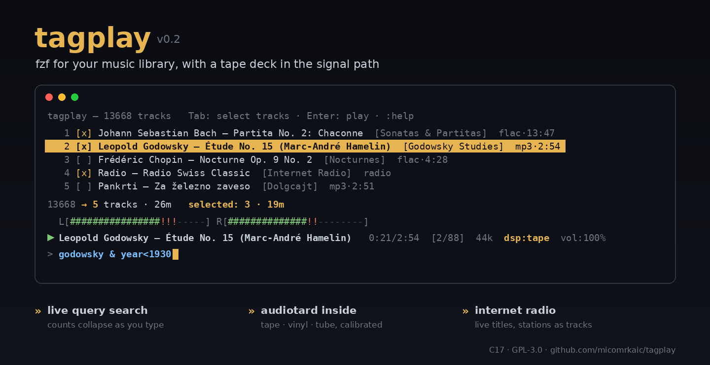

# tagplay

**fzf for your music library, with a tape deck in the signal path.**

tagplay is a terminal music player built around one idea: finding music
should feel like querying a dataset, not browsing a tree. You type an
expression; the match count collapses live with every keystroke; Enter
plays the survivors — through [audiotard](https://github.com/micomrkaic/audiotard)'s
calibrated tape, vinyl, and tube emulations if you like. Written in C17.
One process, one binary, three libraries.

## Features

- **Live query search** — a small expression language over your tags,
  evaluated on every keystroke with a running match count and total
  duration. Bare words, regex (PCRE2), field comparisons, booleans.
- **Curation** — checkbox selection across searches (search, tick,
  search again, tick more), select-all, invert, live selection totals.
- **Playlists** — plain `.m3u` files any player can read; saved from
  the selection or the (reordered) queue, loaded back by name.
- **Playback** — FLAC / WAV / MP3 through a decoder vtable into SDL2
  (ALSA/PipeWire on Linux, CoreAudio on macOS) at each track's native
  sample rate; gapless within same-rate runs; MP3 gapless via LAME
  delay/padding info.
- **Audiotard inside** — `:dsp tape 0.5` and the wow, flutter, hiss and
  head-bump you calibrated run live in the playback path, with state
  rolling through gapless joins. `tube` and `vinyl` likewise.
- **Internet radio** — stations are first-class searchable tracks; ICY
  metadata puts the live stream title in the marquee; failure is
  bounded, never wedging.
- **A quiet, correct display** — full-terminal rendering with surgical
  refresh (the list repaints only on real changes), an ASCII VU meter,
  a 90s-CD-player marquee for long titles, classical-aware rows
  ("Composer — Title (Performer)"), and a one-key tag inspector.
- **Tag hygiene** — "latin1" ID3/RIFF text decoded as CP1252 (so š ž œ
  come out right), every tag sanitized at ingest so no file can inject
  control sequences into your terminal.

## Build

    make            # Linux: libflac-dev libpcre2-dev libsdl2-dev libcurl4-openssl-dev
                    # macOS: brew install flac pcre2 sdl2 curl pkg-config
    make install    # copies to ~/.local/bin

minimp3 and the audiotard DSP are vendored; there is nothing else.
Builds clean with `-Wall -Wextra -Wpedantic`.

## Quick start

    tagplay ~/music

First run scans everything and caches tags (`~/.cache/tagplay/`);
later runs re-read only changed files. Then:

    bach violin              count collapses as you type
    Enter                    play the matches (opens the queue view)
    Tab                      cycle query -> list -> queue -> query
    :dsp tape 0.4            tape emulation, live
    :help                    everything else

One-shot scripting mode:

    tagplay -q 'year<1800 & format=flac' -s year,album,track -t ~/music

## The query language

    bare words              case-insensitive substring over all tags + path;
                            juxtaposition is AND:  bach violin partita
    field ~ "regex"         PCRE2, case-insensitive, UTF-8
    field = value           exact (case-insensitive); != negates
    year<1990  length>=3:00  rate=96000  track<=3     numeric; mm:ss works
    & | ! ( )               booleans; ',' is a synonym for '&'

Fields: any tag key (ARTIST, ALBUM, COMPOSER, GENRE, ...) plus
pseudo-fields `path`, `format` (flac/wav/mp3/radio), `length`, `rate`,
`channels`, `year`, `track`, `disc`. Multi-valued tags match if any
value matches; `!=` means no value matches. Quote regexes containing
spaces, parens, or `|`. Wrapping a whole expression in quotes is
forgiven when it contains an operator (`'year < 1970'` parses as the
comparison); operator-free quoted phrases stay literal substrings.
Untagged files get TITLE/ALBUM/ARTIST synthesized from their path,
marked `SOURCE=path`.

## Views and keys

tagplay is three views over three collections — **search** (matches),
**list** (your selection), **queue** (what's playing) — cycled with Tab.
Esc returns to the query. Typing anything, anywhere, drops you into the
query with that keystroke.

**Search** — type to filter; the count line shows both populations
(`132 tracks · 9h14m   selected: 17 · 1h02m`). **Enter plays the
selection if one exists, else the matches** (and clears the line).

**List** (Tab) — curation over the matches:

    j k g G arrows PgUp/PgDn   move          Space   toggle [x] and advance
    a   add all matches        i   invert    c   clear selection
    t   tag inspector          +/- volume    m   mute (remembers level)

The selection survives query changes — that's how playlists get built.

**Queue** (opens on play) — transport and order:

    Space  pause/resume        left/right  seek -/+10 s     r  restart track
    s      stop (queue kept)   Enter       jump to cursored track
    J K    move track down/up (reorder live; :save keeps the new order)
    t      tag inspector

Anywhere: `Ctrl-P` pause, `Ctrl-N` next, `Ctrl-B` previous.

**The tag inspector** (`t`) shows everything a file carries — identity
keys first (TITLE, ARTIST, ALBUMARTIST, COMPOSER, PERFORMER, CONDUCTOR,
ALBUM, DATE, ...), then the rest — the answer to "which field is that
in?". Rows are classical-aware: a COMPOSER differing from ARTIST renders
as `Composer — Title (Performer)` in list, queue, and marquee.

## Commands

    :sort year,album,-track   sort matches; -field descending; :sort clears
    :save name    :load name    :lists    :clear      m3u playlists
    :p :n :b :stop :seek 1:23 :vol 80                 transport
    :dsp tube|tape|vinyl 0.5   :dsp off               audiotard
    :radio add <url> <name>    :radio rm <name>       stations
    :ls   :stats   :help   :q

## Audiotard

The DSP is audiotard 0.6.6 vendored verbatim, driven by tagplay's C port
of audiotard's own streaming recipe (pre-roll context renders, seam
crossfades, FIR-tail padding, phase-continuous wow via t0, one constant
RMS-match gain at −3 dB headroom). `amount 0.5` is the calibrated
default; the knob scales modulation depths linearly and noise in dB.
Causal streaming costs ~100 ms of one-time priming latency, absorbed by
the SDL queue. Effect state survives same-format track joins — the tape
rolls through gapless boundaries. Levels are RMS-matched, so
`:dsp tape 0.3` vs `:dsp off` compares character, not loudness: the A/B
is fair by construction.

## Internet radio

A starter set is seeded on first run only (Radio Swiss Classic & Jazz,
France Musique, FIP, WQXR, Radio Paradise, SomaFM, NPR, BBC WS, RTV
Slovenija) — see `stations.example`; your edits are never touched.
Stations carry `format=radio` and mix with files in searches,
selections, and playlists. Transport is libcurl with the ICY layer
parsed in `radio.c` (modern Icecast and legacy `ICY 200 OK` both);
the live StreamTitle scrolls in the marquee. MP3 streams only for now.
Failure is bounded: an unreachable station or a non-MP3 stream (AAC,
HLS, error pages) is abandoned within seconds with a `can't play` note,
and the queue advances — the player never wedges. Stream URLs rot over
the years; prune with `:radio rm`.

## Files

    ~/.cache/tagplay/cache.bin        tag cache (versioned; auto-rebuilds)
    ~/.cache/tagplay/stderr.log       library chatter, kept off your screen
    ~/.config/tagplay/playlists/*.m3u saved playlists (portable)
    ~/.config/tagplay/stations        url <TAB> name per line

## Source map

    src/query.c      lexer -> tolerant parser -> AST -> PCRE2 evaluator
    src/scan.c       recursive walk, magic-byte probe, cache-aware
    src/tags_*.c     libFLAC metadata; RIFF INFO; minimal ID3v2.3/2.4
                     (CP1252, UTF-16, unsync, TXXX, multi-value)
    src/cache.c      versioned binary cache, atomic rename
    src/decoder.c    decoder vtable: FLAC / WAV / minimp3 / radio,
                     all emitting interleaved float32
    src/radio.c      curl thread, ring buffer, ICY splitter, StreamTitle
    src/dsp.c        audiotard streaming producer (blocks, pre-roll,
                     crossfades, RMS match)
    src/effects.c    audiotard 0.6.6, verbatim
    src/engine.c     audiotard 0.6.6, verbatim
    src/player.c     audio thread, command mailbox, SDL_QueueAudio,
                     gapless same-rate, VU, bounded failure
    src/repl.c       raw-mode UI: three views, surgical refresh,
                     VU meter, marquee, inspector, commands
    src/main.c       args, cache orchestration, -q/-D/-T modes

Debug modes: `-D FILE` decodes a file fully and reports; `-T FILE`
dumps its tags with odd bytes escaped.

## Tests

    tests/make_fixtures.sh testlib && tests/run.sh testlib

builds a synthetic library (tagged FLAC at three rates, multi-valued
tags, CP1252 cases, an ID3v2 MP3, untagged WAV) and runs the query
regression suite. Development also used a pty harness driving the full
TUI and a local ICY server — good/junk/dead stations included.

## Portability

Linux now; macOS should need only the brew line above (SDL2 audio, no
glibc-isms — `qsort_r` is shimmed). Terminal: anything ANSI/VT100-ish
with UTF-8.

## License

GPL-3.0-or-later; see COPYING. `effects.c`/`engine.c` are audiotard
(same author, same license). minimp3 is CC0 and keeps its own notice.
