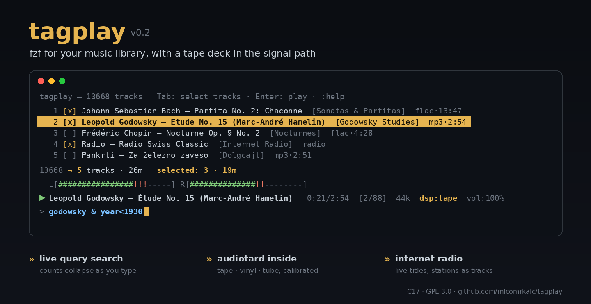

# tagplay

**fzf for your music library, with a tape deck in the signal path.**

tagplay is a terminal music player built around one idea: finding music
should feel like querying a dataset, not browsing a tree. You type an
expression; the match count collapses live with every keystroke; Enter
plays the survivors — through [audiotard](https://github.com/micomrkaic/audiotard)'s
calibrated tape, vinyl, and tube emulations if you like. Written in C17.
One process, one binary, three libraries.

## Features

- **Live query search** — a small expression language over your tags,
  evaluated on every keystroke with a running match count and total
  duration. Bare words, regex (PCRE2), field comparisons, booleans.
- **Curation** — checkbox selection across searches (search, tick,
  search again, tick more), select-all, invert, live selection totals.
- **Playlists** — plain `.m3u` files any player can read; saved from
  the selection or the (reordered) queue, loaded back by name.
- **Playback** — FLAC / WAV / MP3 through a decoder vtable into SDL2
  (ALSA/PipeWire on Linux, CoreAudio on macOS) at each track's native
  sample rate; gapless within same-rate runs; MP3 gapless via LAME
  delay/padding info.
- **Audiotard inside** — `:dsp tape 0.5` and the wow, flutter, hiss and
  head-bump you calibrated run live in the playback path, with state
  rolling through gapless joins. `tube` and `vinyl` likewise.
- **Internet radio** — stations are first-class searchable tracks; ICY
  metadata puts the live stream title in the marquee; failure is
  bounded, never wedging.
- **A quiet, correct display** — full-terminal rendering with surgical
  refresh (the list repaints only on real changes), an ASCII VU meter,
  a 90s-CD-player marquee for long titles, classical-aware rows
  ("Composer — Title (Performer)"), and a one-key tag inspector.
- **Tag hygiene** — "latin1" ID3/RIFF text decoded as CP1252 (so š ž œ
  come out right), every tag sanitized at ingest so no file can inject
  control sequences into your terminal.

## Build

    make            # Linux: libflac-dev libpcre2-dev libsdl2-dev libcurl4-openssl-dev
                    #        optional: libfaad-dev (AAC radio), chafa (best art)
                    # macOS: brew install flac pcre2 sdl2 curl pkg-config
    make install    # copies to ~/.local/bin

minimp3 and the audiotard DSP are vendored; there is nothing else.
Builds clean with `-Wall -Wextra -Wpedantic`.

## Quick start

    tagplay ~/music

First run scans everything and caches tags (`~/.cache/tagplay/`);
later runs re-read only changed files. Then:

    bach violin              count collapses as you type
    Enter                    play the matches (opens the queue view)
    Tab                      cycle query -> list -> queue -> query
    :dsp tape 0.4            tape emulation, live
    :help                    everything else

One-shot scripting mode:

    tagplay -q 'year<1800 & format=flac' -s year,album,track -t ~/music

## The query language

    bare words              case-insensitive substring over all tags + path;
                            juxtaposition is AND:  bach violin partita
    field ~ "regex"         PCRE2, case-insensitive, UTF-8
    field = value           exact (case-insensitive); != negates
    year<1990  length>=3:00  rate=96000  track<=3     numeric; mm:ss works
    & | ! ( )               booleans; ',' is a synonym for '&'

Fields: any tag key (ARTIST, ALBUM, COMPOSER, GENRE, ...) plus
pseudo-fields `path`, `format` (flac/wav/mp3/radio), `length`, `rate`,
`channels`, `year`, `track`, `disc`. Multi-valued tags match if any
value matches; `!=` means no value matches. Quote regexes containing
spaces, parens, or `|`. Wrapping a whole expression in quotes is
forgiven when it contains an operator (`'year < 1970'` parses as the
comparison); operator-free quoted phrases stay literal substrings.
Untagged files get TITLE/ALBUM/ARTIST synthesized from their path,
marked `SOURCE=path`.

## Views and keys

tagplay is three views over three collections — **search** (matches),
**list** (your selection), **queue** (what's playing) — cycled with Tab.
Esc returns to the query. Typing anything, anywhere, drops you into the
query with that keystroke.

**Search** — type to filter; the count line shows both populations
(`132 tracks · 9h14m   selected: 17 · 1h02m`). **Enter plays the
selection if one exists, else the matches.** The query is kept, so Tab
brings you back to the same filtered list with your marks in context.

**List** (Tab) — curation over the matches:

    j k g G arrows PgUp/PgDn   move          Space   toggle [x] and advance
    a   add all matches        i   invert    c   clear selection
    t   tag inspector          +/- volume    m   mute (remembers level)

The selection survives query changes — that's how playlists get built.
The edit loop while listening: Tab out of the queue, refine the marks
(or `:sel` to see exactly the marked set in play order), Enter to
replay, `:save name` to keep it.

**Queue** (opens on play) — transport and order:

    Space  pause/resume        left/right   seek -/+10 s    r  restart track
    < >    seek -/+60 s        Shift-arrows seek -/+60 s    s  stop (queue kept)
    Enter  jump to cursored track           a  album art (full screen)
    J K    move track down/up (reorder live; :save keeps the new order)
    t      tag inspector (tags + cover art)

While playing, the status area shows a live progress bar
(`[=====>----------]`) that slides as you seek — radio streams show
`[ live stream ]` instead — above the marquee status line.

Anywhere: `Ctrl-P` pause, `Ctrl-N` next, `Ctrl-B` previous.

**The tag inspector** (`t`) shows everything a file carries — identity
keys first (TITLE, ARTIST, ALBUMARTIST, COMPOSER, PERFORMER, CONDUCTOR,
ALBUM, DATE, ...), then the rest, then the embedded cover art rendered
as colored ASCII (truecolor terminals) — the answer to "which field is
that in?". `a` in the queue view shows the cover big. Art is read from
FLAC PICTURE blocks and ID3 APIC frames on demand (front cover
preferred), decoded with the vendored stb_image; nothing is cached.
Rendering: if the `chafa` binary is installed it is used (best-in-class
terminal graphics -- optimal symbol selection, dithering, and native
pixel protocols on kitty/iTerm/sixel terminals); otherwise a built-in
truecolor half-block renderer (two pixels per cell). libchafa is
deliberately not linked -- it would pull in GLib. `apt install chafa`
is optional and worth it.

ADTS frame alignment is tagplay's own job: libfaad >= 2.11 no longer
hunts for sync, so joining a live stream mid-frame (which is every
join) is handled by scanning for a validated sync -- a header whose
frame-length lands exactly on another header -- before the decoder
sees a byte, and resynchronization after damage jumps to the next
validated sync rather than inching bytewise. tests/run_radio.sh
replays real captured broadcaster streams (mid-frame joins, starved
delivery, lying Content-Type headers) through the full stack. Rows are classical-aware: a COMPOSER differing from ARTIST renders
as `Composer — Title (Performer)` in list, queue, and marquee.

## Commands

Every `:` command works identically in the terminal and in
tagplay-gui's query bar — they are one code path.

    Search & curation
    :sel                       show only the marked tracks, in playlist
                               order, for editing: Space unmarks, a/i
                               still work, Enter replays; any typing
                               returns to normal search
    :sort year,album,-track    sort matches; -field descending; :sort clears
    :group album               group matches under dim headers, sorted by
                               album then disc/track; any tag key works;
                               :group off
    :cols +year -album         toggle row fields (album year genre fmt dur
                               track); :cols shows current; :cols reset

    Playlists
    :save NAME   :load NAME    :lists   :clear      plain .m3u files

    Transport
    :p :n :b :stop             prev / next / back / stop (queue kept)
    :seek 1:23                 absolute; arrows seek in the queue view
    :vol 80  :vol +5  :vol -5  volume, absolute or relative

    Audiotard DSP
    :dsp tube|tape|vinyl|shellac|am AMOUNT    character modes, amount
                                              0..1 (0.5 = calibrated)
    :dsp eq G1..G10            ten ISO octave bands, dB (-18..+18)
    :dsp bt BASS TREBLE        shelving tone, dB (-12..+12)
    :dsp off                   bypass
    :dsp set NAME VALUE        any granular parameter of the current
                               mode (see :dsp show for names/ranges)
    :dsp params                one-line parameter dump
    :dsp meas                  THD %, H2/H3 dB, noise floor dBFS, SNR
    :dsp show                  full page: every parameter with value,
                               unit and range, plus the measurements

    Spectrum (terminal)
    :fft                       toggle the braille spectrum trace under
                               the status area: clean signal dim, the
                               processed signal bright — same analyzer
                               as the GUI
    :fft ema 0.35              exponential averaging (0 raw .. 1 slow)
    :fft avgn 16               plain mean over the last N frames (2..64)
    :fft on | off              explicit

    Radio & misc
    :radio add URL NAME        :radio rm NAME
    :ls   :stats   :help   :q

## Audiotard

The DSP is audiotard 0.6.6 vendored verbatim, driven by tagplay's C port
of audiotard's own streaming recipe (pre-roll context renders, seam
crossfades, FIR-tail padding, phase-continuous wow via t0, one constant
RMS-match gain at −3 dB headroom). `amount 0.5` is the calibrated
default; the knob scales modulation depths linearly and noise in dB.
Causal streaming costs ~100 ms of one-time priming latency, absorbed by
the SDL queue. Effect state survives same-format track joins — the tape
rolls through gapless boundaries. Levels are RMS-matched, so
`:dsp tape 0.3` vs `:dsp off` compares character, not loudness: the A/B
is fair by construction.

## The DSP chain, in detail

Everything below is what the code does, not marketing. The chain
renders in blocks from a clean input history with 512-frame raised-
cosine crossfades at every block seam, a 16384-frame pre-roll for the
media effects (their modulators need settling), phase-continuous
modulation derived from absolute stream time, and one RMS-match gain
measured against the clean signal at −3 dB headroom (0.708) so every
mode A/Bs at equal loudness. Corner frequencies are clamped to
0.45·fs before any filter is designed — a 22.05 kHz stream gets a
9.9 kHz vinyl lowpass, never a NaN — and the emitted block is scrubbed
of non-finite samples before it can touch the seam tail, the RMS
match, or your ears. A mode change keeps the input history hot and
crossfades old sound into new at the next seam: switching effects is
a transition, not a dropout.

**tube** — memoryless waveshaping at 8× oversampling (anti-aliased),
three shapes: `tanh(g·x)/g` (odd harmonics, symmetric), the default
biased-tanh "tube" (even + odd; `amount` drives g = 2·s with a fixed
0.2 bias), and a pure-H2 `x + a·x²` shape. Granular: `shape`,
`drive`, `bias`, `h2a`, `os`.

**vinyl** — pitch wow via variable-rate resampling (8 cents at
0.55 Hz eccentricity, calibrated), random drift (4 cents, 0.25 Hz
bandwidth), Poisson crackle (12 impulses/s at −33 dB), filtered
surface hiss (−63 dB), and the cartridge/cutter band: 16 kHz lowpass,
25 Hz rumble highpass. `amount` scales modulation depths linearly
and noise in dB.

**tape** — wow (4 c @ 0.8 Hz) plus flutter (2.5 c @ 9 Hz) plus drift
(2 c), the head-bump resonance (+3 dB peak at 65 Hz), progressive HF
loss (0.35 at calibration), hiss at −57 dB, and a 14 kHz lowpass.

**shellac** — a 78 in two eras: acoustic (pre-1925) is horn-cut,
~250 Hz–6 kHz with a mid horn resonance; electric is ~100 Hz–8 kHz.
Mono by nature — noise is seeded per-time, not per-channel, so the
groove hisses identically into both speakers. 12 cents of 1.3 Hz
eccentricity wow, dense crackle (120/s), abrasive-filler hiss.
Cranking `amount` past 1.2× calibration drops you into the horn era.

**am** — the full broadcast chain, mono, vendored from audiotard's
v0.10.3 receiver rewrite: transmitter compression (`comp`, exponent
of the AGC law), modulation with overmodulation fold above 100 %
(`depth` = 0.80 + 0.30·s, capped at 1.40), carrier-domain noise at a
true carrier-to-noise ratio (`snr`, so atmospherics distort through
the detector instead of being pasted on afterwards), a modeled
envelope detector — RC time constant (`detrc`, 60 µs default) for
diagonal clipping on fast HF decay, AC/DC load ratio (`acdc`) for
negative-peak clipping — an 8th-order Butterworth IF/audio bandwidth
(`bw`, 3.5 kHz default) with receiver coupling highpass (`hp`,
150 Hz), carrier-referenced static crashes, two-component skywave
fading (flat + frequency-selective, `fade`/`fadehz`), and the
adjacent channel's heterodyne whistle (`whistle`/`whisthz`, 10 kHz
Americas / 9 kHz elsewhere). The amount knob is a day→night morph:
0 ≈ clean strong local signal (carrier SNR up to 65 dB), 0.5 =
audiotard's calibrated daytime defaults, 1 = the AM_NIGHT skywave
preset — deep selective fades, 6 crashes/s, 35 dB carrier, and the
neighbour whistling at −40 dB. Thirteen parameters: ten on the GUI
panel, `whisthz`/`detrc`/`acdc` via `:dsp set`.

**eq** — ten peaking biquads at the ISO octave centers
31.5 Hz…16 kHz, Q = 1.414, ±18 dB. **tone** — a 120 Hz low shelf and
an 8 kHz high shelf, Q = 0.7071, ±12 dB. Both bypass the RMS match
(an EQ you asked for should sound like more bass, not be normalized
away).

**Measurement** (`:dsp meas`, `:dsp show`, live in the GUI panel):
a shadow chain configured identically to the live one answers two
probes — a ~1 kHz sine (integer cycles per window; Hann-windowed
single-bin DFT at harmonics 2–5 gives THD, H2, H3 immune to the
media noise) and silence (media noise is additive, so what comes out
of nothing is the noise floor, reported in dBFS with the SNR of the
probe over it).

## Internet radio

A starter set is seeded on first run only (Radio Swiss Classic & Jazz,
France Musique, FIP, WQXR, Radio Paradise, SomaFM, NPR, BBC WS, RTV
Slovenija) — see `stations.example`; your edits are never touched.
Stations carry `format=radio` and mix with files in searches,
selections, and playlists. Transport is libcurl with the ICY layer
parsed in `radio.c` (modern Icecast and legacy `ICY 200 OK` both);
the live StreamTitle scrolls in the marquee. MP3 streams only for now.
Failure is bounded: an unreachable station or a non-MP3 stream (AAC,
HLS, error pages) is abandoned within seconds with a `can't play` note,
and the queue advances — the player never wedges. Stream URLs rot over
the years; prune with `:radio rm`.

## Files

    ~/.cache/tagplay/cache.bin        tag cache (versioned; auto-rebuilds)
    ~/.cache/tagplay/stderr.log       library chatter, kept off your screen
    ~/.config/tagplay/playlists/*.m3u saved playlists (portable)
    ~/.config/tagplay/stations        url <TAB> name per line

## tagplay-gui

`make` also builds `tagplay-gui`, the SDL2 face over the very same
controller the terminal uses. Every keystroke is translated to the
TUI's symbolic codes and fed to the shared `browser_key()`, so the
query language, Tab between query/list/queue views, Space marks,
Enter semantics, the queue keys, and every `:` command work
identically **by construction** -- there is no second implementation
to diverge. The mouse is a convenience layer on top: click rows,
double-click to play, click-to-seek, a volume slider, transport
buttons. `t` / `a` / `:help` / `:dsp show` render as overlays, with
embedded art decoded to textures. Radio rides along as in the TUI.

The instrument block (F2 toggles) is the audiotard workbench inside
the player:

- **Waveform strip** -- the whole file, audacity-style, built by a
  background decode pass (decoders run many times realtime); played
  portion accented, click or drag to scrub. Streams get no strip,
  honestly.
- **Spectrum analyser** -- fed by a clean/processed tap around the
  DSP stage: the dim trace is the source, the bright one is what the
  chain did to it. Volume-compensated so the overlay compares
  character, not level; log-frequency axis; the dB top auto-ranges
  to the material with 20 dB gridlines; a control lane under the
  plot picks `ema` (adjustable weight) or `avgN` (plain mean of the
  last N frames, 2..64).
- **Effects panel** -- the eight modes as buttons; per character
  mode the `amt` macro knob on top and the mode's true parameters
  beneath, read live from the chain (an amount morph moves every
  slider; touching one goes manual). Hz parameters get log sliders;
  `era` and `os` snap to integers. Ten EQ bands and the tone
  shelves as before. A live `THD / H2 / H3 / noise` readout,
  recomputed 400 ms after the last tweak. Parameter changes update
  the chain in place -- state and RMS match preserved -- so turning
  a knob never clicks, and switching modes crossfades instead of
  pausing.

Text is JetBrains Mono (OFL, ASCII subset embedded), rasterized at
runtime by the vendored public-domain stb_truetype; audiotard's
fft.c is vendored verbatim. No font files, no link dependencies
beyond the native build's own.

`tagplay-gui --selftest DIR` drives the real event loop headless
under SDL's dummy driver: query/selection/queue semantics, the
`:dsp` paths, FFT bin accuracy, clean-vs-processed divergence under
`am`, no-dropout mode switches, low-rate NaN fences, measurement
physics, and the granular registry round-trip.

## tagplay-gui in the browser (WASM)

The same GUI compiles to WebAssembly -- the zero-install demo:

    sudo apt install emscripten     # Ubuntu 24
    ./tools/build_wasm_deps.sh      # pcre2 + libFLAC to wasm, once
    make wasm                       # -> web/tagplay.{html,js,wasm}
    python3 tools/serve_wasm.py     # COOP/COEP headers, then
                                    # http://localhost:8000/tagplay.html

Drop FLAC/MP3/WAV files anywhere on the page; they land in an
in-memory filesystem and the library rescans. The query language,
Tab views, `:` commands, instrument panel, granular DSP bench and
measurements are the identical code. Radio stays native-only (no
libcurl in the browser, and stations rarely send CORS headers).
Threads need SharedArrayBuffer, hence the COOP/COEP headers; for
itch.io-style hosting, zip the four files in `web/` with
`tagplay.html` renamed `index.html` and enable the site's
SharedArrayBuffer option.

## tagview

The same machinery, pointed at photographs. `make` builds a second
binary, `tagview`: the identical query loop -- live count, list,
selection, `:sel`, grouping, the inspector -- over a photo tree,
reading EXIF (camera, date, dimensions), IPTC-IIM (keywords, title,
byline, city), XMP (`dc:subject` et al) and PNG text chunks, merged
into one multi-valued tag model. Enter shows the cursored image
full-screen (chafa when installed); `t` inspects the merged tags with
the image inline. Queries work exactly as in tagplay:

    tag=alps & year<2000 & camera~nikon
    width>4000 & mpix>10
    city=Bohinj | tag=lake

tagview links only pcre2 -- none of the audio stack. Caches and
config live in ~/.cache/tagview and ~/.config/tagview, fully separate
from the player's. Read-only in this milestone: tag WRITING (the `+`
key, sidecars for RAW, the polajuice keystroke) is the next one.
tests/run_view.sh runs the metadata battery against fixtures written
by exiftool -- an independent implementation checking mine.

## Source map

The tree is split into shared machinery and the player, ahead of a
sibling image browser (tagview) that will reuse the core:

    src/core/        app-agnostic: the item-with-tags model, query
                     engine, scanner, cache, art rendering, utilities.
                     Core never assumes items are audio: everything
                     app-specific goes through the tp_app descriptor
                     (src/core/app.h) -- file probing, tag reading,
                     format names, query pseudo-fields, cacheability,
                     embedded-art extraction.
                     The interactive browser (query line, list,
                     selection, grouping, surgical refresh) lives in
                     core/browser.c and drives the app through the same
                     descriptor: row identity, the alternate view (the
                     player's queue), the status region (VU/marquee),
                     transport keys, and app commands are all hooks.
    src/play/        the music player: decoders, DSP, radio, transport,
                     console.c (the player's answers to the browser's
                     UI hooks), and app_play.c (the audio answers to
                     the data-plane hooks)

    src/core/query.c lexer -> tolerant parser -> AST -> PCRE2 evaluator
    src/scan.c       recursive walk, magic-byte probe, cache-aware
    src/tags_*.c     libFLAC metadata; RIFF INFO; minimal ID3v2.3/2.4
                     (CP1252, UTF-16, unsync, TXXX, multi-value)
    src/cache.c      versioned binary cache, atomic rename
    src/decoder.c    decoder vtable: FLAC / WAV / minimp3 / radio,
                     all emitting interleaved float32
    src/radio.c      curl thread, ring buffer, ICY splitter, StreamTitle
    src/art.c        FLAC PICTURE / ID3 APIC extraction, stb_image
                     decode, colored-ASCII render
    src/dsp.c        audiotard streaming producer (blocks, pre-roll,
                     crossfades, RMS match)
    src/effects.c    audiotard 0.6.6, verbatim
    src/engine.c     audiotard 0.6.6, verbatim
    src/player.c     audio thread, command mailbox, SDL_QueueAudio,
                     gapless same-rate, VU, bounded failure
    src/repl.c       raw-mode UI: three views, surgical refresh,
                     VU meter, marquee, inspector, commands
    src/main.c       args, cache orchestration, -q/-D/-T modes

Debug modes: `-D FILE` decodes a file fully and reports; `-T FILE`
dumps its tags with odd bytes escaped.

## Tests

    tests/make_fixtures.sh testlib && tests/run.sh testlib

builds a synthetic library (tagged FLAC at three rates, multi-valued
tags, CP1252 cases, an ID3v2 MP3, untagged WAV) and runs the query
regression suite. Development also used a pty harness driving the full
TUI and a local ICY server — good/junk/dead stations included.

## Portability

Linux now; macOS should need only the brew line above (SDL2 audio, no
glibc-isms — `qsort_r` is shimmed). Terminal: anything ANSI/VT100-ish
with UTF-8.

## License

GPL-3.0-or-later; see COPYING. `effects.c`/`engine.c` are audiotard
(same author, same license). minimp3 (CC0) and stb_image (public domain/MIT) keep their own notices.
